# 🏗️ Spring Boot Task Manager - Clean Architecture Demo

## 🎯 Overview

This repository demonstrates **Clean Architecture** principles with **Spring Boot 3.x** and serves as a comprehensive showcase for **GitHub Copilot Coding Agent** capabilities in enterprise Java development.

**Repository:** https://github.com/dc24aicrew/copilot-demo-spring-taskmanager

## 🏛️ Clean Architecture Implementation

### Architecture Layers


### Clean Architecture Dependency Flow

```mermaid
graph LR
    subgraph "Dependency Direction"
        A[🌐 Presentation] --> B[📋 Application]
        B --> C[💼 Domain]
        D[🔧 Infrastructure] --> C
        
        style C fill:#4caf50,color:#fff
        style A fill:#2196f3,color:#fff
        style B fill:#ff9800,color:#fff
        style D fill:#9c27b0,color:#fff
    end
    
    subgraph "Key Principle"
        E["🎯 Domain Layer<br/>• No external dependencies<br/>• Pure business logic<br/>• Framework agnostic"]
        
        style E fill:#e8f5e8
    end
```



### Domain-Driven Design (DDD) Patterns
- **Entities**: `User`, `Task` with rich business logic
- **Value Objects**: `UserId`, `TaskId`, `Email`, `UserRole`
- **Repositories**: Abstract data access patterns
- **Services**: Application orchestration logic
- **Mappers**: Clean DTO transformation

## 🚀 Technology Stack

### Core Framework
- **Spring Boot 3.2.1** with Java 17
- **Spring Security 6** for authentication & authorization
- **Spring Data JPA** with Hibernate for persistence
- **Spring Boot Actuator** for monitoring
- **Spring Cache** for performance optimization

### Database & Persistence
- **PostgreSQL** as primary database
- **Flyway** for database migrations
- **H2** for testing environments
- **JPA Auditing** for entity tracking

### Security & Authentication
- **JWT** token-based authentication
- **BCrypt** password encoding
- **Role-based access control** (RBAC)
- **Method-level security** with annotations

### Testing & Quality
- **JUnit 5** for unit testing
- **TestContainers** for integration testing
- **ArchUnit** for architecture testing
- **Jacoco** for code coverage
- **MapStruct** for mapping

### Documentation & API
- **SpringDoc OpenAPI 3** for API documentation
- **Swagger UI** for interactive API testing
- **Actuator endpoints** for health monitoring

## 📁 Project Structure

```
src/main/java/com/demo/copilot/taskmanager/
├── domain/                          # Domain Layer (Pure Business Logic)
│   ├── entity/                      # Domain Entities
│   │   ├── User.java               # User aggregate root
│   │   └── Task.java               # Task aggregate root
│   └── valueobject/                # Value Objects
│       ├── UserId.java             # User identifier
│       ├── TaskId.java             # Task identifier
│       ├── Email.java              # Email value object
│       ├── UserRole.java           # User role enumeration
│       ├── TaskStatus.java         # Task status enumeration
│       ├── TaskPriority.java       # Task priority enumeration
│       └── TaskCategory.java       # Task category enumeration
│
├── application/                     # Application Layer (Use Cases)
│   ├── service/                    # Application Services
│   │   └── UserService.java       # User business operations
│   ├── dto/                        # Data Transfer Objects
│   │   └── user/                   # User-related DTOs
│   ├── mapper/                     # Domain ↔ DTO Mappers
│   │   └── UserMapper.java        # MapStruct mapper
│   └── exception/                  # Application Exceptions
│       ├── UserNotFoundException.java
│       ├── DuplicateEmailException.java
│       └── DuplicateUsernameException.java
│
├── infrastructure/                  # Infrastructure Layer (External Concerns)
│   ├── repository/                 # Data Access
│   │   ├── UserRepository.java     # User data access
│   │   └── TaskRepository.java     # Task data access
│   ├── configuration/              # Spring Configuration
│   │   └── SecurityConfig.java     # Security setup
│   └── security/                   # Security Implementation
│       ├── JwtAuthenticationFilter.java
│       └── JwtAuthenticationEntryPoint.java
│
└── presentation/                    # Presentation Layer (Web Interface)
    └── controller/                 # REST Controllers (to be implemented)
```

## 🛠️ Quick Start

### Prerequisites
- **Java 17** or later
- **Maven 3.8+**
- **PostgreSQL 13+** (or Docker)
- **Git**

### Local Development Setup

1. **Clone the repository**
   ```bash
   git clone https://github.com/dc24aicrew/copilot-demo-spring-taskmanager.git
   cd copilot-demo-spring-taskmanager
   ```

2. **Setup PostgreSQL Database**
   ```bash
   # Using Docker
   docker run -d --name postgres-taskmanager \
     -e POSTGRES_DB=taskmanager_demo \
     -e POSTGRES_USER=taskmanager \
     -e POSTGRES_PASSWORD=taskmanager \
     -p 5432:5432 postgres:15-alpine
   
   # Or install PostgreSQL locally and create database
   createdb taskmanager_demo
   ```

3. **Configure Environment Variables**
   ```bash
   export DB_USERNAME=taskmanager
   export DB_PASSWORD=taskmanager
   export JWT_SECRET=your-super-secret-jwt-key-minimum-32-characters-long
   ```

4. **Build and Run**
   ```bash
   # Build the project
   mvn clean compile
   
   # Run tests
   mvn test
   
   # Start the application
   mvn spring-boot:run
   
   # Or run with specific profile
   mvn spring-boot:run -Dspring-boot.run.profiles=dev
   ```

5. **Verify Installation**
   - Application: http://localhost:8080/api
   - Health Check: http://localhost:8080/api/actuator/health
   - API Documentation: http://localhost:8080/api/swagger-ui.html
   - API Docs JSON: http://localhost:8080/api/v3/api-docs

## 🎭 GitHub Copilot Demo Scenarios

This repository is specifically designed to showcase GitHub Copilot Coding Agent capabilities through real-world enterprise scenarios:

### 🏗️ **Issue #1: Microservices Architecture Migration**
**Complexity**: Epic (6-8 weeks)
**Focus**: System architecture transformation
**Technologies**: Spring Cloud, Docker, Kubernetes, Event-driven architecture

**Demo Highlights**:
- Service decomposition strategy
- Inter-service communication patterns
- Database per service implementation
- Event sourcing and CQRS patterns
- Container orchestration
- Distributed monitoring and observability

### 🚨 **Issue #2: Security Vulnerabilities & Performance**
**Complexity**: Critical (4-5 weeks)
**Focus**: Production-ready security and performance optimization
**Technologies**: Spring Security, JWT, Caching, Database optimization

**Demo Highlights**:
- Advanced JWT implementation with proper key management
- Input validation and sanitization
- Database security and query optimization
- Caching strategies with Redis
- Performance monitoring and tuning
- Security testing and compliance

### 📊 **Issue #3: Advanced Analytics & ML Dashboard**
**Complexity**: Epic (8-10 weeks)
**Focus**: Data analytics and machine learning integration
**Technologies**: Apache Kafka, Redis, ML pipelines, Real-time processing

**Demo Highlights**:
- Real-time analytics with Spring WebFlux
- Machine learning model integration
- Event streaming with Kafka
- Time-series data processing
- Interactive dashboard development
- Predictive analytics implementation

## 🎪 Demo Execution Guide

### **Preparation Steps**

1. **Environment Setup**
   ```bash
   # Ensure all dependencies are installed
   mvn dependency:resolve
   
   # Verify application starts successfully
   mvn spring-boot:run
   
   # Check that all issues are visible and well-documented
   ```

2. **Demo Data** (Optional)
   ```bash
   # Create sample users and tasks for realistic demo
   curl -X POST http://localhost:8080/api/auth/register \
     -H "Content-Type: application/json" \
     -d '{"username":"demo","email":"demo@example.com","password":"Demo@123","firstName":"Demo","lastName":"User","role":"USER"}'
   ```

### **Demo Flow Options**

#### **🚀 Executive Demo** (20 minutes)
*Focus on business value and architectural decisions*

1. **Architecture Overview** (5 minutes)
   - Clean Architecture benefits
   - Domain-driven design principles
   - Technology stack rationale

2. **Microservices Migration** (10 minutes)
   - Assign Copilot to Issue #1
   - Show service decomposition strategy
   - Discuss scalability and maintainability benefits

3. **Enterprise Security** (5 minutes)
   - Quick demo of Issue #2 assignment
   - Highlight security best practices
   - Discuss compliance and audit requirements

#### **👨‍💻 Technical Deep Dive** (45 minutes)
*Focus on implementation details and code quality*

1. **Clean Architecture Walkthrough** (10 minutes)
   - Domain layer principles
   - Dependency inversion demonstration
   - Value objects and entities

2. **Security Implementation** (15 minutes)
   - Assign Issue #2 to Copilot
   - Watch JWT service implementation
   - Review security configuration
   - Discuss testing strategies

3. **Analytics System Design** (20 minutes)
   - Assign Issue #3 to Copilot
   - Show real-time data processing
   - Review ML integration approach
   - Discuss performance optimization

#### **🏗️ Architecture Workshop** (60 minutes)
*Focus on system design and best practices*

1. **Current State Analysis** (15 minutes)
   - Monolithic application review
   - Technical debt identification
   - Scalability challenges

2. **Microservices Transformation** (30 minutes)
   - Issue #1 comprehensive implementation
   - Service boundaries definition
   - Data consistency strategies
   - Event-driven communication

3. **Production Readiness** (15 minutes)
   - Security hardening (Issue #2)
   - Monitoring and observability
   - Performance optimization
   - Deployment strategies

## 🎯 Key Demo Messages

### **For Developers**
- **Productivity**: Faster implementation of complex patterns
- **Quality**: Better adherence to Clean Architecture principles
- **Learning**: Exposure to enterprise Java best practices
- **Innovation**: More time for creative problem-solving

### **For Architects**
- **Consistency**: Standardized implementation patterns
- **Scalability**: Proper microservices design principles
- **Maintainability**: Clean separation of concerns
- **Performance**: Optimized enterprise-grade solutions

### **For Leadership**
- **Velocity**: Accelerated development cycles
- **Quality**: Reduced technical debt and bugs
- **Compliance**: Built-in security and best practices
- **Innovation**: Faster experimentation and prototyping

## 📋 Best Practices Demonstrated

### Domain-Driven Design
- **Bounded contexts** with clear service boundaries
- **Ubiquitous language** in code and documentation
- **Value objects** for type safety and validation
- **Aggregate roots** for data consistency

### Spring Boot Enterprise Patterns
- **Configuration management** with profiles
- **Security integration** with method-level authorization
- **Data access optimization** with JPA best practices
- **Monitoring and observability** with Actuator

### Testing Strategies
- **Unit testing** with domain logic isolation
- **Integration testing** with TestContainers
- **Architecture testing** with ArchUnit
- **Security testing** with Spring Security Test

## 🔧 Advanced Features

### Observability
- **Health Checks**: Custom health indicators
- **Metrics**: Micrometer integration
- **Distributed Tracing**: Spring Cloud Sleuth ready
- **Logging**: Structured logging with correlation IDs

### Performance
- **Caching**: Multi-level caching strategy
- **Database Optimization**: Query optimization and indexing
- **Async Processing**: Non-blocking operations
- **Connection Pooling**: HikariCP configuration

### Security
- **Authentication**: JWT with refresh tokens
- **Authorization**: Role and method-based security
- **Input Validation**: Comprehensive validation framework
- **Security Headers**: OWASP recommended headers

## 🚀 Ready for Demo!

This repository provides a comprehensive showcase of enterprise Java development with Spring Boot and Clean Architecture principles. The carefully crafted issues demonstrate Copilot's ability to handle complex architectural decisions, security implementations, and advanced feature development.

**Happy Coding with GitHub Copilot! 🤖✨**

---

*For questions or support, please open an issue or refer to the detailed documentation in each package.*